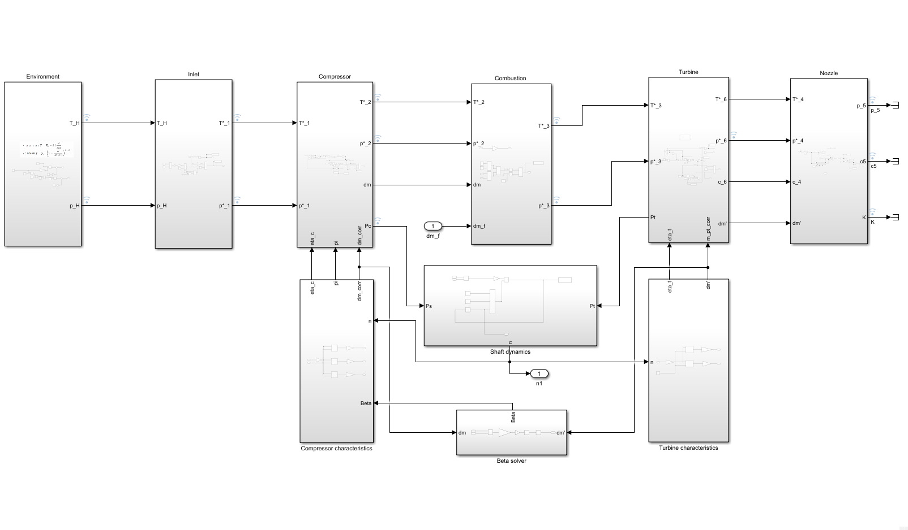

# turboJetModel

Numerical model of a single-spool turbojet engine for a cruise missile, with a
Model Predictive Controller (MPC) written in C++ and compared against a PI
baseline.

This is the code behind my bachelor thesis in Aerospace Engineering (Avionics
and Control Systems, Wrocław University of Science and Technology, 2026).
Full text: [EngineeringThesis.pdf](EngineeringThesis.pdf)

## What it does

- **Component-level engine model in Matlab/Simulink.** Inlet, compressor,
  combustion chamber, turbine, nozzle and shaft dynamics are separate
  subsystems, so each can be verified on its own. Compressor and turbine
  behaviour comes from 2-D performance maps (beta-lines method), and the state
  vector `x = [n, β]` lets the model track the compressor surge margin.
- **Linearised state-space model** around the nominal operating point
  (16 000 RPM), obtained by trimming and numerical linearisation with
  Simulink Control Design. It is the basis for the predictive controller.
- **Two controllers on the same plant:**
  - PI with back-calculation anti-windup (baseline)
  - Offset-free MPC with a filtered disturbance estimator, written in C++ with
    the Eigen library (`MPC.cpp`) and connected to Simulink

## Scenarios

| Scenario | What it tests |
|---|---|
| Ramp up | Two-stage acceleration; fuel pump saturation and anti-windup |
| Rapid descent | Rising inlet pressure and density; spontaneous spool-up without control |
| Exhaust gas suction | Change in gas properties (κ, gas constant) at the compressor inlet |
| Inlet pressure distortion | 10 % pressure drop, e.g. during high-angle-of-attack manoeuvres |

Results and plots for each scenario are in chapter 5 of the thesis.

## Main findings (from the thesis)

- With saturated fuel flow, rise time is identical for PI and MPC. Only the
  settling time differs, because MPC anticipates the setpoint.
- Under constant fuel flow, exhaust gas suction drops engine speed by about
  500 RPM in one second. Both controllers recover, and MPC recovers faster.
- Without anti-windup, the PI controller overshoots significantly in the
  ramp-up scenario.
- MPC costs far more computation than PI (a quadratic programme at every
  step), so PI stays a valid choice on limited hardware.

## Repository contents

| File | Purpose |
|---|---|
| `Model.slx` | Non-linear reference model and control loop |
| `MPC.cpp`, `MPC_wrapper.cpp`, `MPC.tlc`, `rtwmakecfg.m` | C++ MPC and its Simulink integration |
| `MPC.mexw64` | Compiled MEX (Windows, 64-bit) |
| `generate_maps.m`, `mapy_new.m`, `Mapy.m` | [describe: compressor / turbine map generation] |
| `Dane.m` | [describe: engine parameters] |
| `gen3Dplots.m`, `fig*.png` | Map and Brayton cycle plots |
| `SFB__MPC__SFB.mat` | [describe, or remove if not needed] |
| `EngineeringThesis.pdf` | Full thesis |

## How to run

Requirements: Matlab/Simulink, Simulink Control Design (for linearisation), a C++ compiler.

1. Run `Dane.m` to load parameters
2. Run `mapy_new.m` to load compresor and turbine maps
3. Open `Model.slx` and choose the controller
4. Run a scenario

## Limitations

- **Not validated against measured engine data.** The model is checked by
  comparing controllers on the same plant, not against test-bench results.
- Single-spool, fixed-geometry nozzle, quasi-steady thermodynamics (no
  pressure and temperature dynamics in the volumes).
- Single-input single-output control (fuel flow to shaft speed).
- Linear model is valid near the nominal operating point; the disturbance
  estimator compensates for the mismatch in the tested scenarios.

## Possible next steps

Transient thermodynamics, variable nozzle, variable compressor geometry and
bleed valves, coupling with 6-DOF flight dynamics, and hardware-in-the-loop
tests of the C++ controller on an embedded target. See chapter 7 of the thesis.
